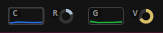

# SysMon

A native GNOME Shell top-bar system monitor with live CPU/GPU plots, RAM/VRAM donuts, and a dropdown for process stats.

## Install

```bash
./install.sh
```

This installs the GNOME Shell extension version of SysMon and queues it to load on GNOME Shell restart.

Then restart GNOME Shell:

- `Alt+F2`
- type `r`
- press `Enter`

Or log out and back in.

## Uninstall

```bash
./uninstall-extension.sh
```

## Screenshot



## What it shows

### Top bar
- CPU rolling usage plot
- RAM donut meter
- GPU rolling usage plot
- VRAM donut meter
- optional compact numeric label support in code (off by default)

### Dropdown
- CPU summary
- RAM summary
- GPU / VRAM summary
- top CPU processes
- top RAM processes
- active GPU compute processes
- last refresh time

## Design

SysMon runs as a **GNOME Shell extension**.

That means it:
- renders directly inside GNOME Shell
- avoids constantly swapping tray PNG files
- avoids the Ubuntu AppIndicators bridge
- is much less likely to trigger shell stutter/freeze from tray icon churn

## Resource profile

The extension updates once per second and draws a very small in-shell visual widget. In practice, the rendering cost should be low; the main runtime cost is the metric sampling itself, especially `nvidia-smi` and process queries. The extension is designed to be lightweight enough for normal desktop use, but GPU/process polling is still the dominant cost, not the tiny plots/donuts.

## Files

- `install.sh` — install GNOME Shell extension
- `uninstall-extension.sh` — remove GNOME Shell extension
- `gnome-extension/` — GNOME Shell extension source
